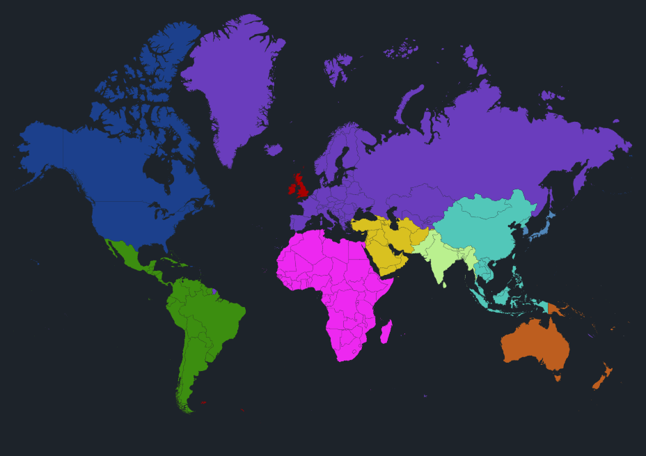

## Main Menu Pages
Red ~ Alerts/Notifications
- Record Deals
- Chart Position Changes
- Record Label Announcements
- Song/Album Debuts

Blue ~ Home
- all the basic information, where you'll spend most of your time

Yellow ~ Account/Player
- Base Stats
    - Stress
        - Rises with overworking yourself
        - Lower by taking breaks/vacations
        - Increases risk of burnout and creative block
        - If too high, decreases health
    - Creativity
        - Lowers if too much "creative" work is done in short period of time
        - Rises with time
        - Effects songwriting and producing
    - Happiness
        - Lowers if stress is too high, rises when stress is low
        - Gives boosts to creativity if high, hurts if low
        - Can amplify stress if very low
- Music Stats
    - Singing
    - Live Singing
    - Rapping
    - Performing
    - Songwriting
    - Production
    - Charisma

Orange ~ Shop 
- Merch Types:
    - T-Shirts
    - Hoodies
    - Caps
    - Beanies
- Music Types:
    - CD Single
    - Vinyl Single
    - Digital Single
    - CD Album/EP
    - Vinyl Album/EP
    - Casette Album/EP
    - Digital Album/EP

Purple ~ Charts
- 48 total charts across the 8 regions
- Top 50 Songs by radio play per region
- Top 50 Songs by streams per region 
- Top 100 Songs per region
- Top 100 Artists by units per region
- Top 100 Artists by streams per region
- Top 200 Albums/EPs per region
- 8 Regions (shown below):

Green ~ Statistics
- top 15 songs by units sold (streaming and pure)
- albums ranked by units sold
- albums/EPs ranked by critical acclaim

